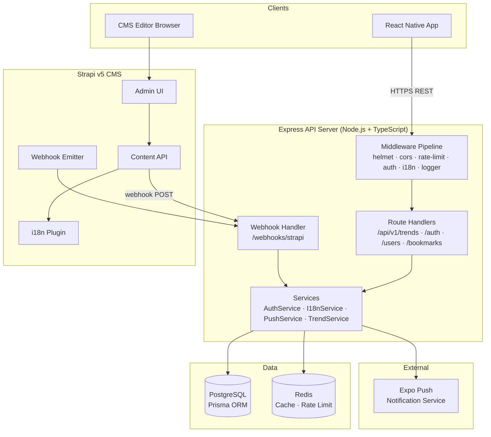
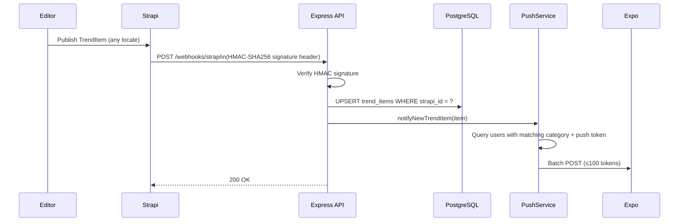

# Design Document — Trendify Backend CMS

## Overview

The Trendify backend replaces the existing JSONPlaceholder mock with a production-grade Node.js + Express API backed by PostgreSQL, a Strapi v5 CMS for content management, and Redis for caching and rate limiting. The system adds real authentication (JWT RS256), user profiles, bookmarks, push notifications, and full multilingual support while preserving the existing frontend API contract.

Key design goals:
- Honour the existing `/api/v1/trends` contract without frontend changes
- Provide a clean separation between the Express API server and the Strapi CMS
- Support multilingual content via Strapi's i18n plugin and BCP 47 locale resolution
- Be fully containerised and deployable via CI/CD

---

## Architecture

### Component Diagram



### Request Flow

```
Client → TLS Termination → helmet → cors → correlationId → requestLogger
       → rateLimiter → [authMiddleware] → i18nMiddleware → routeHandler
       → Service → Prisma → PostgreSQL
                 → Redis (cache read/write)
       → responseLogger → Client
```

---

## Components and Interfaces

### Directory Structure

```
trendify-backend/
├── apps/
│   ├── api/                          # Express API server
│   │   ├── src/
│   │   │   ├── config/
│   │   │   │   └── env.ts            # Zod-validated env schema
│   │   │   ├── middleware/
│   │   │   │   ├── auth.middleware.ts
│   │   │   │   ├── correlation.middleware.ts
│   │   │   │   ├── i18n.middleware.ts
│   │   │   │   ├── rateLimiter.middleware.ts
│   │   │   │   └── validate.middleware.ts
│   │   │   ├── routes/
│   │   │   │   ├── trends.router.ts
│   │   │   │   ├── auth.router.ts
│   │   │   │   ├── users.router.ts
│   │   │   │   ├── bookmarks.router.ts
│   │   │   │   └── webhooks.router.ts
│   │   │   ├── services/
│   │   │   │   ├── auth.service.ts
│   │   │   │   ├── trend.service.ts
│   │   │   │   ├── bookmark.service.ts
│   │   │   │   ├── push.service.ts
│   │   │   │   ├── i18n.service.ts
│   │   │   │   └── health.service.ts
│   │   │   ├── schemas/              # Zod request/response schemas
│   │   │   ├── types/                # Shared TypeScript types
│   │   │   ├── utils/
│   │   │   │   ├── logger.ts         # Winston/pino structured logger
│   │   │   │   └── metrics.ts        # Prometheus client setup
│   │   │   ├── app.ts                # Express app factory
│   │   │   └── server.ts             # HTTP server entry point
│   │   ├── prisma/
│   │   │   ├── schema.prisma
│   │   │   └── migrations/
│   │   ├── Dockerfile
│   │   ├── jest.config.ts
│   │   └── tsconfig.json
│   └── cms/                          # Strapi v5 instance
│       ├── src/
│       │   ├── api/
│       │   │   └── trend-item/
│       │   │       ├── content-types/
│       │   │       │   └── trend-item/
│       │   │       │       └── schema.json
│       │   │       └── controllers/
│       │   └── extensions/
│       ├── config/
│       │   ├── plugins.ts            # i18n plugin config
│       │   └── middlewares.ts
│       └── Dockerfile
├── docker-compose.yml
├── docker-compose.test.yml
├── .env.example
└── .github/
    └── workflows/
        └── ci.yml
```

### Service Interfaces

```typescript
// AuthService
interface AuthService {
  register(email: string, password: string): Promise<AuthTokenPair>;
  login(email: string, password: string): Promise<AuthTokenPair>;
  refresh(refreshToken: string): Promise<AuthTokenPair>;
  logout(userId: string): Promise<void>;
  verifyAccessToken(token: string): Promise<JwtPayload>;
  revokeAllTokens(userId: string): Promise<void>;
}

// TrendService
interface TrendService {
  listTrends(params: FetchTrendParams): Promise<TrendItemPage>;
  getTrendById(id: string, locale: string): Promise<TrendItem>;
  upsertFromWebhook(payload: StrapiWebhookPayload): Promise<void>;
}

// BookmarkService
interface BookmarkService {
  addBookmark(userId: string, trendItemId: string): Promise<void>;
  removeBookmark(userId: string, trendItemId: string): Promise<void>;
  listBookmarks(userId: string, cursor?: string, pageSize?: number): Promise<TrendItemPage>;
}

// PushService
interface PushService {
  registerToken(userId: string, token: string): Promise<void>;
  notifyNewTrendItem(trendItem: TrendItem): Promise<void>;
}

// I18nService
interface I18nService {
  resolveLocale(req: Request): string;
  isValidBcp47(tag: string): boolean;
  formatError(key: string, locale: string): string;
}

// HealthService
interface HealthService {
  liveness(): { status: 'ok' };
  readiness(): Promise<{ status: 'ok' | 'unavailable'; reason?: string }>;
}
```

### Middleware Pipeline

| Order | Middleware | Purpose |
|-------|-----------|---------|
| 1 | `helmet` | Security headers (HSTS, X-Content-Type-Options, X-Frame-Options) |
| 2 | `cors` | Restrict origins to `ALLOWED_ORIGINS` env list |
| 3 | `correlationId` | Attach/propagate `X-Correlation-ID` |
| 4 | `requestLogger` | Structured JSON log per request |
| 5 | `rateLimiter` | Redis-backed sliding window; 100 req/min unauth, 300 req/min auth |
| 6 | `authMiddleware` | Verify RS256 JWT on protected routes; attach `req.user` |
| 7 | `i18nMiddleware` | Resolve locale from `locale` param → `Accept-Language` → user prefs → `en` |
| 8 | `validate` | Run Zod schema against `req.body` / `req.query` |
| 9 | Route handler | Business logic via services |
| 10 | `errorHandler` | Catch-all; map errors to HTTP responses; never expose stack traces |

### API Endpoint Specifications

#### Trends

| Method | Path | Auth | Description |
|--------|------|------|-------------|
| GET | `/api/v1/trends` | Optional | List trends with cursor pagination |
| GET | `/api/v1/trends/:id` | None | Get single trend item |

**GET /api/v1/trends query params:**
```
categories?: string   (comma-separated Category values)
regionCode?: string
cursor?:     string   (opaque base64 cursor)
pageSize?:   number   (1–100, default 20)
locale?:     string   (BCP 47)
```

**TrendItemPage response:**
```json
{
  "items": [TrendItem],
  "nextCursor": "string | null",
  "totalCount": "number"
}
```

**TrendItem shape:**
```json
{
  "id": "uuid",
  "title": "string",
  "description": "string",
  "source": "string",
  "publishedAt": "ISO8601",
  "imageUrl": "string | null",
  "url": "string",
  "category": "Category",
  "regionCode": "string | null",
  "locale": "string (BCP 47)"
}
```

#### Auth

| Method | Path | Auth | Description |
|--------|------|------|-------------|
| POST | `/api/v1/auth/register` | None | Register new user |
| POST | `/api/v1/auth/login` | None | Login |
| POST | `/api/v1/auth/refresh` | None | Rotate refresh token |
| POST | `/api/v1/auth/logout` | Bearer | Revoke refresh token |

**AuthTokenPair response:**
```json
{ "accessToken": "string", "refreshToken": "string" }
```

#### Users

| Method | Path | Auth | Description |
|--------|------|------|-------------|
| GET | `/api/v1/users/me` | Bearer | Get own profile |
| PATCH | `/api/v1/users/me` | Bearer | Update displayName |
| GET | `/api/v1/users/me/preferences` | Bearer | Get preferences |
| PUT | `/api/v1/users/me/preferences` | Bearer | Replace preferences |
| POST | `/api/v1/users/me/push-token` | Bearer | Register push token |

**UserProfile response:**
```json
{
  "id": "uuid",
  "email": "string",
  "displayName": "string | null",
  "createdAt": "ISO8601"
}
```

**UserPreferences shape:**
```json
{
  "categories": ["Category"],
  "regionCode": "string | null",
  "locale": "string (BCP 47)"
}
```

#### Bookmarks

| Method | Path | Auth | Description |
|--------|------|------|-------------|
| GET | `/api/v1/bookmarks` | Bearer | List bookmarked trends |
| POST | `/api/v1/bookmarks/:trendItemId` | Bearer | Add bookmark |
| DELETE | `/api/v1/bookmarks/:trendItemId` | Bearer | Remove bookmark |

#### Internal / Infrastructure

| Method | Path | Auth | Description |
|--------|------|------|-------------|
| POST | `/webhooks/strapi` | HMAC secret | Receive CMS events |
| GET | `/health/live` | None | Liveness probe |
| GET | `/health/ready` | None | Readiness probe |
| GET | `/metrics` | None (internal) | Prometheus metrics |

---

## Data Models

### Prisma Schema

```prisma
generator client {
  provider = "prisma-client-js"
}

datasource db {
  provider = "postgresql"
  url      = env("DATABASE_URL")
}

model User {
  id           String          @id @default(uuid())
  email        String          @unique
  passwordHash String
  displayName  String?
  createdAt    DateTime        @default(now())
  updatedAt    DateTime        @updatedAt

  refreshTokens RefreshToken[]
  bookmarks     Bookmark[]
  preferences   UserPreferences?
  pushTokens    PushToken[]
}

model RefreshToken {
  id        String   @id @default(uuid())
  token     String   @unique
  userId    String
  expiresAt DateTime
  revokedAt DateTime?
  createdAt DateTime @default(now())

  user User @relation(fields: [userId], references: [id], onDelete: Cascade)

  @@index([userId])
  @@index([token])
}

model TrendItem {
  id          String    @id @default(uuid())
  strapiId    String    @unique   // Strapi document ID
  title       String
  description String
  source      String
  publishedAt DateTime
  imageUrl    String?
  url         String
  category    Category
  regionCode  String?
  locale      String    @default("en")
  published   Boolean   @default(true)
  createdAt   DateTime  @default(now())
  updatedAt   DateTime  @updatedAt

  bookmarks Bookmark[]

  @@index([category])
  @@index([regionCode])
  @@index([locale])
  @@index([publishedAt(sort: Desc)])
}

model Bookmark {
  id          String   @id @default(uuid())
  userId      String
  trendItemId String
  createdAt   DateTime @default(now())

  user      User      @relation(fields: [userId], references: [id], onDelete: Cascade)
  trendItem TrendItem @relation(fields: [trendItemId], references: [id], onDelete: Cascade)

  @@unique([userId, trendItemId])
  @@index([userId, createdAt(sort: Desc)])
}

model UserPreferences {
  id         String     @id @default(uuid())
  userId     String     @unique
  categories Category[]
  regionCode String?
  locale     String     @default("en")
  updatedAt  DateTime   @updatedAt

  user User @relation(fields: [userId], references: [id], onDelete: Cascade)
}

model PushToken {
  id        String   @id @default(uuid())
  userId    String
  token     String   @unique
  createdAt DateTime @default(now())

  user User @relation(fields: [userId], references: [id], onDelete: Cascade)

  @@index([userId])
}

enum Category {
  technology
  sports
  finance
  entertainment
  health
  science
}
```

### Cursor Pagination Design

Cursors are opaque base64-encoded JSON objects containing `{ publishedAt: ISO8601, id: uuid }`. This enables stable keyset pagination:

```sql
WHERE (published_at, id) < (cursor.publishedAt, cursor.id)
ORDER BY published_at DESC, id DESC
LIMIT pageSize + 1
```

If `pageSize + 1` rows are returned, a `nextCursor` is computed from the last item and the extra row is dropped from the response.

### Strapi Content Type — TrendItem

`apps/cms/src/api/trend-item/content-types/trend-item/schema.json`:

```json
{
  "kind": "collectionType",
  "collectionName": "trend_items",
  "info": {
    "singularName": "trend-item",
    "pluralName": "trend-items",
    "displayName": "TrendItem"
  },
  "options": { "draftAndPublish": true },
  "pluginOptions": {
    "i18n": { "localized": true }
  },
  "attributes": {
    "title":       { "type": "string",   "required": true,  "pluginOptions": { "i18n": { "localized": true } } },
    "description": { "type": "text",     "required": true,  "pluginOptions": { "i18n": { "localized": true } } },
    "source":      { "type": "string",   "required": true },
    "publishedAt": { "type": "datetime", "required": true },
    "imageUrl":    { "type": "string" },
    "url":         { "type": "string",   "required": true },
    "category":    { "type": "enumeration", "enum": ["technology","sports","finance","entertainment","health","science"], "required": true },
    "regionCode":  { "type": "string" }
  }
}
```

Only `title` and `description` are localised; all other fields are shared across locales.

### Webhook Flow



### Caching Strategy (Redis)

| Cache Key Pattern | TTL | Invalidation |
|-------------------|-----|-------------|
| `trends:list:{hash(params)}` | 60 s | On webhook upsert for matching category |
| `trends:item:{id}:{locale}` | 300 s | On webhook upsert for that strapiId |
| `user:prefs:{userId}` | 300 s | On PUT /users/me/preferences |

Cache-aside pattern: check Redis → on miss, query Postgres → write to Redis → return.

### Migration Strategy

Prisma manages all schema migrations:

1. `prisma migrate dev` — generates and applies migration in development
2. `prisma migrate deploy` — applies pending migrations in production (run on container startup before `server.ts` binds the port)
3. Each migration file is committed to `prisma/migrations/` and named with a timestamp + description
4. Migration failures halt startup and log the full Prisma error (Requirement 15.4)

---

## Correctness Properties

*A property is a characteristic or behavior that should hold true across all valid executions of a system — essentially, a formal statement about what the system should do. Properties serve as the bridge between human-readable specifications and machine-verifiable correctness guarantees.*

### Property 1: Category filter correctness

*For any* set of category values and any database state, every TrendItem returned by `GET /api/v1/trends?categories=...` must have a `category` field whose value is one of the requested categories.

**Validates: Requirements 1.2**

---

### Property 2: Region filter with fallback correctness

*For any* regionCode and any database state, the returned TrendItems must either match the requested regionCode or have a null regionCode, and regional items must be preferred over null-region items when both exist.

**Validates: Requirements 1.3**

---

### Property 3: Cursor pagination — completeness and non-overlap

*For any* valid combination of filter parameters (categories, regionCode, locale) and any database state, paginating through all pages using the returned `nextCursor` values must yield each matching TrendItem exactly once, with no duplicates and no omissions.

**Validates: Requirements 1.4, 18.5**

---

### Property 4: pageSize enforcement

*For any* pageSize value: if it is in the range 1–100, the response must contain at most that many items; if it is outside that range, the response must be HTTP 400.

**Validates: Requirements 1.5, 1.6**

---

### Property 5: TrendItem lookup round-trip

*For any* TrendItem that exists in the database, `GET /api/v1/trends/:id` must return a TrendItem whose `id`, `title`, `category`, and `locale` fields exactly match the stored record.

**Validates: Requirements 1.7**

---

### Property 6: Registration creates a user with hashed password

*For any* valid email and password (≥ 8 characters), calling `register` must: (a) persist a User record whose `passwordHash` is a valid bcrypt hash that does not equal the plaintext password, and (b) return an AuthTokenPair containing a non-empty `accessToken` and `refreshToken`.

**Validates: Requirements 2.1, 2.6**

---

### Property 7: Short password rejection

*For any* password string whose length is less than 8 characters, the registration endpoint must return HTTP 400 with a validation error.

**Validates: Requirements 2.3**

---

### Property 8: Login round-trip

*For any* registered user, calling `login` with the correct email and password must return an AuthTokenPair, and calling `login` with an incorrect password must return HTTP 401.

**Validates: Requirements 2.4, 2.5**

---

### Property 9: Token expiry invariants

*For any* issued AccessToken, its JWT `exp` claim must be exactly 15 minutes after `iat`. *For any* issued RefreshToken, its `expiresAt` database field must be exactly 30 days after its `createdAt`.

**Validates: Requirements 2.7, 2.8**

---

### Property 10: Refresh token rotation

*For any* valid RefreshToken, calling `POST /api/v1/auth/refresh` must return a new AccessToken and a new RefreshToken that is different from the original, and the original RefreshToken must be revoked (subsequent use returns HTTP 401).

**Validates: Requirements 3.1, 3.2**

---

### Property 11: Logout revokes refresh token

*For any* authenticated user, after calling `POST /api/v1/auth/logout`, the associated RefreshToken must be revoked such that a subsequent `POST /api/v1/auth/refresh` with that token returns HTTP 401.

**Validates: Requirements 3.3**

---

### Property 12: Password change invalidates all refresh tokens

*For any* user with N active RefreshTokens, after a password change, all N tokens must be revoked and each must return HTTP 401 on a refresh attempt.

**Validates: Requirements 3.4**

---

### Property 13: Protected route authentication enforcement

*For any* protected endpoint, a request with a valid Bearer AccessToken must be processed (2xx or domain-level error), while a request with a missing, expired, or malformed token must return HTTP 401.

**Validates: Requirements 4.1, 4.2, 4.3**

---

### Property 14: User profile round-trip

*For any* registered user, `GET /api/v1/users/me` must return a UserProfile whose `email` matches the registration email. After `PATCH /api/v1/users/me` with a new `displayName`, a subsequent `GET /api/v1/users/me` must return the updated `displayName`.

**Validates: Requirements 5.1, 5.2**

---

### Property 15: Preferences round-trip

*For any* valid UserPreferences payload (valid categories, optional regionCode, valid BCP 47 locale), `PUT /api/v1/users/me/preferences` must persist the preferences such that a subsequent `GET /api/v1/users/me/preferences` returns an equivalent payload.

**Validates: Requirements 5.3**

---

### Property 16: Invalid category in preferences rejected

*For any* category value not in the defined Category enum, `PUT /api/v1/users/me/preferences` must return HTTP 400 with a validation error.

**Validates: Requirements 5.4**

---

### Property 17: Stored preferences applied as default filters

*For any* authenticated user with stored UserPreferences (categories, regionCode, locale), a `GET /api/v1/trends` request with no explicit filter parameters must return only items matching those stored preferences.

**Validates: Requirements 5.5**

---

### Property 18: Bookmark round-trip

*For any* authenticated user and any existing TrendItem, adding a bookmark via `POST /api/v1/bookmarks/:id` must result in that TrendItem appearing in `GET /api/v1/bookmarks`. After `DELETE /api/v1/bookmarks/:id`, the item must no longer appear in the list.

**Validates: Requirements 6.1, 6.3**

---

### Property 19: Bookmarks ordered by creation date descending

*For any* user with multiple bookmarks, `GET /api/v1/bookmarks` must return items in strictly descending order of bookmark `createdAt` timestamp.

**Validates: Requirements 6.5**

---

### Property 20: Push token storage round-trip

*For any* authenticated user and any valid Expo push token string, `POST /api/v1/users/me/push-token` must persist the token such that it is associated with that user in the database.

**Validates: Requirements 7.1**

---

### Property 21: Push notification fan-out correctness

*For any* new TrendItem with category C, the PushService must send notifications to exactly the set of users whose UserPreferences include category C and who have at least one stored push token — no more, no fewer.

**Validates: Requirements 7.2**

---

### Property 22: Push batch size invariant

*For any* number of recipient push tokens N, the PushService must split them into batches of at most 100 tokens, resulting in ⌈N/100⌉ Expo API calls.

**Validates: Requirements 7.4**

---

### Property 23: Push retry limit

*For any* retriable Expo error, the PushService must attempt delivery at most 3 times total (1 initial + 2 retries) before logging the failure and stopping.

**Validates: Requirements 7.5**

---

### Property 24: Webhook HMAC validation

*For any* incoming webhook request, if the HMAC-SHA256 signature computed from the shared secret does not match the `X-Strapi-Signature` header, the endpoint must return HTTP 401 and must not process the payload.

**Validates: Requirements 9.4**

---

### Property 25: Webhook upsert correctness

*For any* valid Strapi webhook payload containing a TrendItem, after the webhook handler processes it, querying the database by `strapiId` must return a TrendItem whose fields match the payload.

**Validates: Requirements 9.2**

---

### Property 26: Validation error response shape

*For any* request body that fails Zod schema validation, the response must be HTTP 400 with a JSON body containing a `message` string field and an `errors` array with at least one entry describing the failure.

**Validates: Requirements 10.2**

---

### Property 27: Unhandled exception response safety

*For any* request that triggers an unhandled exception in a route handler, the response must be HTTP 500 with `{ "message": "Internal server error" }` and must not contain any stack trace, file path, or internal module information.

**Validates: Requirements 10.3**

---

### Property 28: Rate limit enforcement

*For any* IP address making more than 100 requests within a 60-second window to unauthenticated endpoints, the (101st+) request must receive HTTP 429 with a `Retry-After` header. *For any* authenticated user making more than 300 requests within 60 seconds, the same applies.

**Validates: Requirements 11.1, 11.2, 11.3**

---

### Property 29: Rate limit headers invariant

*For any* HTTP response from the API, the `X-RateLimit-Limit`, `X-RateLimit-Remaining`, and `X-RateLimit-Reset` headers must all be present.

**Validates: Requirements 11.4**

---

### Property 30: Correlation ID propagation

*For any* request that includes an `X-Correlation-ID` header, the response must include the same value in its `X-Correlation-ID` header. For any request without that header, the response must include a newly generated non-empty `X-Correlation-ID`.

**Validates: Requirements 13.4**

---

### Property 31: Locale resolution priority

*For any* request to `GET /api/v1/trends`, the resolved locale must follow this precedence: (1) `locale` query parameter if present and valid, (2) `Accept-Language` header if present, (3) authenticated user's stored locale preference if authenticated, (4) `en` as the final fallback. A request with both a `locale` param and an `Accept-Language` header must use the `locale` param.

**Validates: Requirements 19.3, 19.4, 19.5**

---

### Property 32: Locale fallback to English

*For any* TrendItem requested in a locale L for which no L-variant exists, the response must contain the `en`-locale version of that item and must include a `Content-Language: en` response header.

**Validates: Requirements 19.6**

---

### Property 33: Content-Language header invariant

*For any* TrendItem response (single item or list), the `Content-Language` response header must be present and must contain a valid BCP 47 tag matching the locale of the returned content.

**Validates: Requirements 19.13**

---

### Property 34: BCP 47 locale validation

*For any* string value supplied as the `locale` field in a UserPreferences update: if it is a well-formed BCP 47 language tag, the request must succeed and persist the value; if it is not well-formed, the response must be HTTP 400.

**Validates: Requirements 19.10, 19.11**

---

### Property 35: Multilingual TrendItem JSON round-trip

*For any* TrendItem that has content in multiple locales, serialising the item to JSON and deserialising it back must produce an object that is deeply equal to the original for every locale variant — all fields including `title`, `description`, `locale`, `category`, `id`, and `publishedAt` must be preserved exactly.

**Validates: Requirements 18.4, 19.14**

---

## Error Handling

### Error Response Contract

All error responses conform to:
```json
{ "message": "string", "errors": [{ "field": "string", "message": "string" }] }
```
The `errors` array is omitted for non-validation errors.

### Error Mapping

| Condition | HTTP Status | Message |
|-----------|-------------|---------|
| Zod validation failure | 400 | Descriptive per-field errors |
| Invalid pageSize | 400 | "pageSize must be between 1 and 100" |
| Invalid category enum | 400 | "Invalid category value" |
| Invalid BCP 47 locale | 400 | "locale must be a valid BCP 47 language tag" |
| Missing/invalid auth token | 401 | "Authentication required" / "Invalid or expired token" |
| Invalid credentials | 401 | "Invalid credentials" |
| Invalid/expired refresh token | 401 | "Invalid or expired refresh token" |
| Duplicate email | 409 | "Email already registered" |
| Duplicate bookmark | 409 | "Already bookmarked" |
| Resource not found | 404 | Descriptive message |
| Rate limit exceeded | 429 | "Too many requests" + Retry-After header |
| Webhook HMAC mismatch | 401 | "Unauthorized" |
| Unhandled exception | 500 | "Internal server error" |

### Global Error Handler

The Express error handler (`errorHandler` middleware) is the last middleware registered. It:
1. Catches all errors passed via `next(err)`
2. Maps known error types (ZodError, PrismaClientKnownRequestError, custom AppError subclasses) to appropriate HTTP responses
3. Logs all 5xx errors with correlation ID and stack trace (server-side only)
4. Never exposes stack traces, file paths, or Prisma internals to the client

### Webhook Error Handling

If the webhook handler throws, it returns HTTP 500 so Strapi retries delivery. The full event payload is logged at `error` level with the correlation ID.

---

## Testing Strategy

### Dual Testing Approach

Both unit/integration tests and property-based tests are required and complementary:
- Unit/integration tests: verify specific examples, edge cases, and error conditions
- Property-based tests: verify universal properties across randomly generated inputs

### Test Configuration

- Framework: **Jest** + **Supertest** (integration)
- Property-based: **fast-check** (minimum 100 runs per property)
- Test database: isolated PostgreSQL instance via `docker-compose.test.yml`
- Coverage target: ≥ 80% line coverage on `auth.service.ts`

### Unit Tests

Focus areas:
- `AuthService`: register, login, refresh, logout, token verification — all branches
- `I18nService`: locale resolution priority, BCP 47 validation, fallback logic
- `PushService`: batch splitting, retry logic, token removal on non-retriable errors
- `TrendService`: cursor encoding/decoding, filter application, locale fallback
- Middleware: `authMiddleware`, `i18nMiddleware`, `rateLimiter`, `correlationId`, `errorHandler`
- Zod schemas: valid and invalid inputs for every schema

### Integration Tests

One test file per router, exercising the full request–response cycle against a real test database:
- `trends.router.test.ts` — all filter combinations, pagination, locale, 404
- `auth.router.test.ts` — register, login, refresh, logout, duplicate email, short password
- `users.router.test.ts` — profile CRUD, preferences CRUD, push token registration
- `bookmarks.router.test.ts` — add, remove, list, duplicates, missing items
- `webhooks.router.test.ts` — valid payload upsert, HMAC rejection, processing failure
- `health.router.test.ts` — liveness, readiness, DB-down scenario

### Property-Based Tests

Each property test uses `fast-check` with `{ numRuns: 100 }` and is tagged with a comment referencing the design property.

Tag format: `// Feature: trendify-backend-cms, Property {N}: {property_text}`

| Property | Test Description | fast-check Arbitraries |
|----------|-----------------|----------------------|
| P3 | Pagination completeness and non-overlap | `fc.array(trendItemArb)`, `fc.record({ categories, regionCode, locale })` |
| P4 | pageSize enforcement | `fc.integer()` (full range including out-of-bounds) |
| P6 | Registration creates hashed password | `fc.emailAddress()`, `fc.string({ minLength: 8 })` |
| P7 | Short password rejection | `fc.string({ maxLength: 7 })` |
| P9 | Token expiry invariants | `fc.emailAddress()`, `fc.string({ minLength: 8 })` |
| P10 | Refresh token rotation | valid registered user + valid refresh token |
| P22 | Push batch size invariant | `fc.array(expoTokenArb, { minLength: 0, maxLength: 500 })` |
| P23 | Push retry limit | mock Expo returning retriable errors |
| P24 | Webhook HMAC validation | `fc.string()` (random payloads and signatures) |
| P26 | Validation error response shape | `fc.record(...)` with invalid field combinations |
| P28 | Rate limit enforcement | sequential request sequences exceeding limits |
| P30 | Correlation ID propagation | `fc.option(fc.uuid())` (present or absent) |
| P31 | Locale resolution priority | `fc.record({ localeParam, acceptLanguage, userLocale })` |
| P34 | BCP 47 locale validation | `fc.string()` (mix of valid and invalid BCP 47 tags) |
| P35 | Multilingual TrendItem JSON round-trip | `fc.record(trendItemMultilocaleArb)` |

### CI Pipeline

```yaml
# .github/workflows/ci.yml (outline)
jobs:
  test:
    steps:
      - lint (eslint --max-warnings 0)
      - type-check (tsc --noEmit)
      - unit tests (jest --testPathPattern=unit --coverage)
      - integration tests (jest --testPathPattern=integration)
      - property tests (jest --testPathPattern=property)
  build:
    needs: test
    if: github.ref == 'refs/heads/main'
    steps:
      - docker build (multi-stage)
      - docker push to registry
```

All tests must complete within 120 seconds (Requirement 18.3).
